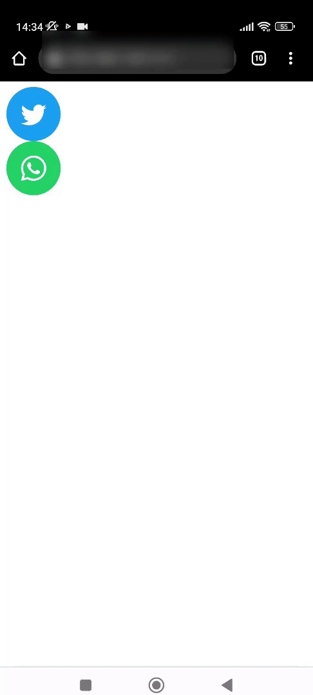

# react-share-widget

=======

## Installation

``` bash
npm i react-share-widget
```

## Usage

### TwitterButton

```jsx
import { TwitterButton } from 'react-share-widget';
```

```jsx
<div>
  <TwitterButton text="Hello World!" />
</div>
```

### WhatsappButton

```jsx
import { WhatsappButton } from 'react-share-widget';
```

```jsx
<div>
  <WhatsappButton phone="+905555555555" text="I want to buy your product!" />
</div>
```

## Demo


